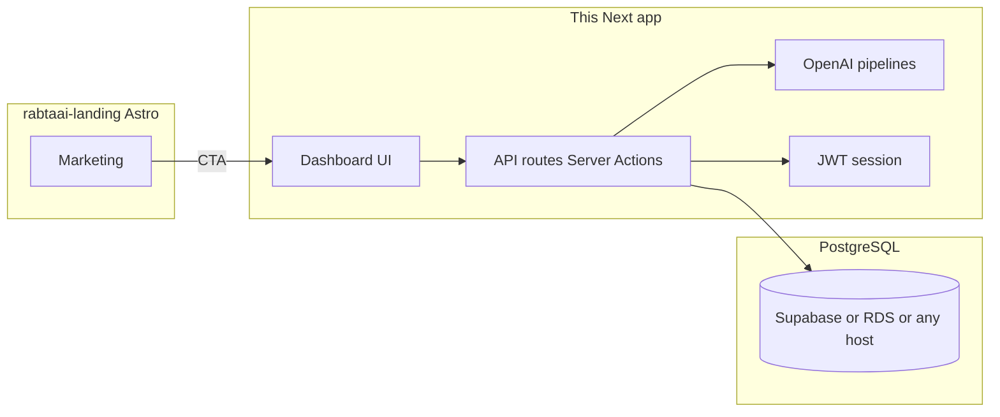

# Raabta AI — AI infrastructure platform (`backend-dashboard-rabta`)

Single **Next.js App Router** product: build and run **chatbots**, **voice agents**, and **operator workflows** on one tenant-scoped control plane — knowledge (RAG), workflows, omnichannel conversations, voice front desk, API ingress (`/api/v1/…`), metering, and human escalations all share the same **PostgreSQL** data model and server-only **OpenAI** calls. The database can live on **Supabase Postgres**, **RDS**, or any other host via **`DATABASE_URL`** (and network access), not an app rewrite.

**In-app entry point:** after login, open **Build → Agent platform** (`/platform`) for a map of capabilities, and **Build → Chat & voice agents** (`/platform/agents`) to define agent personas (instructions + optional workflows) and assign **chat** agents to conversations so AI replies use your configuration.

The public marketing site is only a brochure/CTA in **[`rabtaai-landing`](../rabtaai-landing)** (Astro); the platform you ship is this dashboard + APIs.

## Architecture (short)

- **Frontend:** Next.js 15, TypeScript, Tailwind, shadcn-style UI (Base UI), Motion, Recharts.
- **Auth:** Email/password against `app_users` (bcrypt) + **JWT session cookie** (`SESSION_SECRET`). `profiles` links each user to a `tenant_id` and `role` (`admin` | `agent`). Authorization is enforced in the Next.js server layer (API routes / Server Actions / middleware), not via Supabase Auth.
- **Data:** Normalized schema under `supabase/migrations/` (SQL files; runnable in Supabase SQL Editor, `psql`, RDS, etc.). The app connects with **`pg`** using **`DATABASE_URL`** (or `POSTGRES_URL` / `SUPABASE_DATABASE_URL` as aliases). **Drizzle ORM** is integrated for typed SQL: schema in `lib/db/schema/`, shared client via `getDb()` or `(await createUserClient()).db` — same pool as the legacy `QueryBuilder`. **DDL stays in SQL migrations**; refresh the Drizzle schema after big migration changes (`npm run db:introspect` when a live DB is available, then reconcile `lib/db/schema/`).
- **Live monitor:** `live_events` is polled via **`GET /api/live-events`** (no browser Supabase Realtime dependency).
- **AI:** `OPENAI_API_KEY` is read only in Route Handlers (`app/api/ai/*`) and Server Actions (`app/(dashboard)/**/actions.ts`, `lib/ai/*`). The browser never sees the key.
- **Orchestration:** `lib/orchestration/workflows.ts` implements channel-agnostic actions (card block/freeze, complaints, cases, live events, agent summaries). **Workflows** (n8n-style, V1 linear graphs) live in Postgres (`workflows`, `workflow_runs`, `workflow_run_steps`), are edited under **Workflows** in the nav, and execute via `lib/orchestration/run-workflow.ts` (internal steps + HTTP to a configurable adapter). The in-app **mock adapter** is at `/api/mock-adapter/*` for demos.



## Main demo / portfolio flows

1. **Suspicious transaction → block card → complaint → adapter ping (workflow)**  
   In **Conversations**, open **Run workflow** and choose **Card fraud — block + complaint + adapter** (uses the first card on file). That runs the saved graph: internal block + complaint + `POST` to the mock adapter. You can still use the one-click **Block card** action for the legacy handoff + AI summary path when `OPENAI_API_KEY` is set.

2. **Raast issue**  
   Seed includes an escalated **app_chat** conversation and a **Raast / IBFT** complaint. **Analytics** and **Channels** reflect categories from live data.

3. **FAQ / policy (KB)**  
   **Generate AI reply** on a conversation uses `searchKnowledge` (semantic **pgvector** when chunks exist; ILIKE fallback) + `generateConversationReply`. New articles trigger embedding reindex on save; admins can **Rebuild embeddings** on Knowledge. **Mark resolved** flags `containment_resolved` for containment KPIs.

4. **Workplace assistant (tools + RAG)**  
   **Assistant** in the nav: OpenAI tool loop with `search_knowledge_base`, operations digest, hiring lookup by reference, markdown **insight panel**, personalized survey draft/save/assign (admins), survey submit, course MCQs. Sessions persist in `assistant_sessions` / `assistant_messages`.

5. **Public hiring status**  
   Unauthenticated **`/hiring-status`**: candidates enter tenant slug, reference code, and secure token (UUID). Backed by `lookup_hiring_application` RPC (no row enumeration). **Production:** add rate limiting (e.g. edge middleware, WAF, or Upstash) on `POST /api/public/hiring-status`.

6. **Voice escalation**  
   **Voice Calls** simulator: **Escalate** updates the call, generates a handoff summary via OpenAI, writes `agent_summaries`, and surfaces work in **Agent Assist**.

7. **Voice front-desk (Urdu-first, multilingual guarded rollout)**  
   **Voice Front Desk** route adds short-call intake in front of human agents: language detect/lock, FAQ-first responses, structured detail capture, callback/ticket workflows, and clean human handoff with transcript/disposition.

## AI provider platform (API v1)

Server-to-server integration boundary for **ingress**, **metering**, and **audit export** (Bearer API keys created under **Settings** by admins).

| Endpoint | Scope | Purpose |
|----------|--------|---------|
| `POST /api/v1/events/ingest` | `events:write` | Append `live_events` rows from external systems |
| `GET /api/v1/metrics/usage?from=&to=` | `metrics:read` | Aggregate `usage_events` (also fed by assistant + workflow runs) |
| `GET /api/v1/audit/events?limit=&cursor=` | `audit:read` | Paginated `audit_events` |

Keys use the `rk_live_…` prefix (shown **once** at creation). **Production:** rate-limit public routes, rotate keys, and keep DB credentials server-only.

**Multi-tenant onboarding (CLI):** `npm run db:create-tenant -- --name "Org" --slug org-slug --email admin@org --password '…'` (requires Postgres URL in env — see below).

**Optional HTTP bootstrap:** `POST /api/platform/bootstrap-tenant` with header `X-Platform-Bootstrap-Secret: $PLATFORM_BOOTSTRAP_SECRET` and JSON body `{ "name", "slug", "admin_email", "admin_password" }` — disabled until the env var is set (≥16 chars recommended).

**Deployment / SLA metadata:** `Settings` → provider profile (region, residency note, optional audit webhook URL, runbook link). **Integrations** → per-tenant connector registry (CBS, card rail, ATS, SIEM, etc.).

## Workflow manager (n8n-style, V1)

- **Model:** One `trigger_manual` node plus a **linear** chain of steps (internal allowlisted actions or HTTP). Definitions are validated with **Zod** (`lib/orchestration/workflow-definition.ts`).
- **UI:** **Workflows** in the sidebar — admins compose steps and optional JSON; agents can open definitions read-only and see run history.
- **Operators:** **Conversations** / **Voice** expose **Run workflow** for enabled manual workflows whose **channels** include the current surface. **Intent match** workflows appear as suggested buttons when the conversation intent string equals the configured value.
- **Security:** No arbitrary code in JSON — only closed node types and fixed internal keys. HTTP paths/bodies use allowlisted placeholders (`{cardId}`, `{customerId}`, …). Prefer `BANK_ADAPTER_BASE_URL` pointing at your VPC/mTLS service; optional `BANK_ADAPTER_API_KEY` stays server-side. Step payloads in `workflow_run_steps` are lightly redacted for logs.

## Where real bank integrations plug in later

- **Ingress:** Mobile SDK events, IVR/transcription streams → normalize into `conversations`, `conversation_messages`, or `calls` with `channel_type` set.
- **Core / cards / Raast:** Adapter modules (see **Integrations** page) should call your cores and then invoke the same `lib/orchestration/workflows` functions so SLAs, complaints, and analytics stay consistent.
- **Egress:** Poll `GET /api/live-events` or configure **Settings → Live events webhook** (POST JSON per new `live_events` row, optional `X-Raabta-Signature: v1=<hmac>`).

## Setup

**Order matters:** apply the SQL migrations **before** `npm run db:seed`. If you skip step 1, login will fail with **`relation "app_users" does not exist`** (`42P01`) or similar missing-table errors.

### 1. Database (Supabase Postgres **or** RDS **or** any Postgres)

**Fast path (uses `DATABASE_URL` from `.env`):**

```bash
npm run db:migrate
```

Then seed (step 3). If a migration fails partway (e.g. `ALTER PUBLICATION` on a host without Supabase Realtime), fix or comment that statement and re-run, or apply the remaining files manually in **SQL Editor** / `psql`.

**Manual path:**

1. **Supabase:** **SQL Editor** → **New query** — run each migration file in order (same list as below).
2. **RDS / other:** enable **`pgcrypto`** and **`vector`** (for assistant/RAG), then run the same SQL with `psql` or your migration runner.

Run migrations **in order**:

1. [`supabase/migrations/20250330120000_initial_schema.sql`](supabase/migrations/20250330120000_initial_schema.sql)
2. [`supabase/migrations/20250330130000_workflows.sql`](supabase/migrations/20250330130000_workflows.sql)
3. [`supabase/migrations/20250404120000_assistant_platform.sql`](supabase/migrations/20250404120000_assistant_platform.sql) (pgvector, knowledge chunks, surveys, courses, hiring, assistant)
4. [`supabase/migrations/20250405130000_provider_infra.sql`](supabase/migrations/20250405130000_provider_infra.sql) (API keys, usage, audit, connectors, `provider_profile`)
5. [`supabase/migrations/20250406140000_legacy_supabase_auth_users.sql`](supabase/migrations/20250406140000_legacy_supabase_auth_users.sql) (optional — only if you use `auth.users` alongside `app_users`)
6. [`supabase/migrations/20260402120000_voice_frontdesk.sql`](supabase/migrations/20260402120000_voice_frontdesk.sql) (Voice Front Desk tables)
7. [`supabase/migrations/20260404100000_ai_agents.sql`](supabase/migrations/20260404100000_ai_agents.sql) (**`ai_agents`** + **`conversations.agent_id`** — chat/voice agent builder)
8. [`supabase/migrations/20260405120000_control_plane_maturity.sql`](supabase/migrations/20260405120000_control_plane_maturity.sql) (agent studio fields, KB governance columns, workflow catalog metadata, voice session fields, junction tables)

Optional: if a file references `ALTER PUBLICATION supabase_realtime` and your host has no Supabase Realtime, skip or remove those statements — the dashboard uses HTTP polling for `live_events`, not Realtime.

### 2. Environment

Copy [`.env.example`](.env.example) to `.env.local` and fill:

- **`DATABASE_URL`** — PostgreSQL URI (Supabase **Settings → Database → Connection string**, or RDS endpoint). Aliases supported: `POSTGRES_URL`, `SUPABASE_DATABASE_URL` (first non-empty wins).
- **`SESSION_SECRET`** — at least 16 characters; signs the session cookie.
- **`OPENAI_API_KEY`**
- **`NEXT_PUBLIC_LANDING_URL`** (Astro dev default `http://localhost:4321`)
- Optional: `BANK_ADAPTER_BASE_URL`, `BANK_ADAPTER_API_KEY`, `INTERNAL_APP_URL` / `NEXT_PUBLIC_APP_URL` — see [`.env.example`](.env.example).

### 3. Seed demo data + users

```bash
npm install
npm run db:seed
```

**Troubleshooting login:** if Postgres returns `relation "app_users" does not exist`, the schema was never applied or only partly applied. Try:

1. `npm run db:migrate` on a **new** database (or run the SQL files in order in Supabase SQL Editor).  
2. If `db:migrate` fails early with “already exists” (e.g. `type "app_role" already exists`) but `app_users` is still missing, run **`npm run db:ensure-auth`** to create the table, then **`npm run db:seed`** again. For a clean slate, use a fresh Supabase project or drop/recreate the `public` schema and re-run all migrations.

Defaults:

- **Admin:** `admin@demo.raabta.ai`
- **Agent:** `agent@demo.raabta.ai`
- **Password:** `DemoRaabta123!` or `DEMO_SEED_PASSWORD` from env

### 4. Run locally

```bash
npm run dev
```

Dashboard: [http://localhost:3001](http://localhost:3001) (redirects to `/login` → `/overview`).

Run the Astro site separately from `../rabtaai-landing` (`npm run dev` there on port **4321**).

## Deploy (e.g. Vercel + Postgres)

1. Deploy **this repo** as a Next.js project. Set **server** env: `DATABASE_URL` (or alias), `SESSION_SECRET`, `OPENAI_API_KEY`, etc.
2. Deploy **rabtaai-landing** as a static Astro site. Set `PUBLIC_DASHBOARD_URL` to your production dashboard URL (e.g. `https://your-app.vercel.app/login`).
3. Ensure the database allows connections from your hosting provider (Supabase: default; RDS: security group / VPC).

## Case study blurb (portfolio)

> **Raabta AI** is a portfolio-grade **AI infrastructure platform** in one Next app: configure knowledge and workflows, run chat and voice agents, expose v1 APIs for ingress and metering, and escalate to humans — all tenant-scoped on PostgreSQL with server-only OpenAI. The Astro site is marketing only; the product is this dashboard + routes.

## Scripts

| Script        | Purpose                          |
| ------------- | -------------------------------- |
| `npm run dev` | Next dev server (port 3001)      |
| `npm run build` / `start` | Production            |
| `npm run db:migrate` | `tsx scripts/apply-migrations.ts` — run all `supabase/migrations/*.sql` in order |
| `npm run db:ensure-auth` | `tsx scripts/ensure-app-users.ts` — create `public.app_users` if missing (repair half-applied DB) |
| `npm run db:seed` | Alias: `tsx scripts/seed.ts` |
| `npm run db:create-tenant` | `tsx scripts/create-tenant.ts` — new tenant + admin (`DATABASE_URL` / alias) |
| `npm run db:studio` | Drizzle Kit Studio (browse DB; needs `DATABASE_URL`) |
| `npm run db:introspect` | Drizzle introspect → writes under `./drizzle/` (merge into `lib/db/schema/` by hand if you use this) |
| `npm run test` | Run Vitest unit tests |

---

MIT-style use for portfolio demos; not a licensed banking product.
